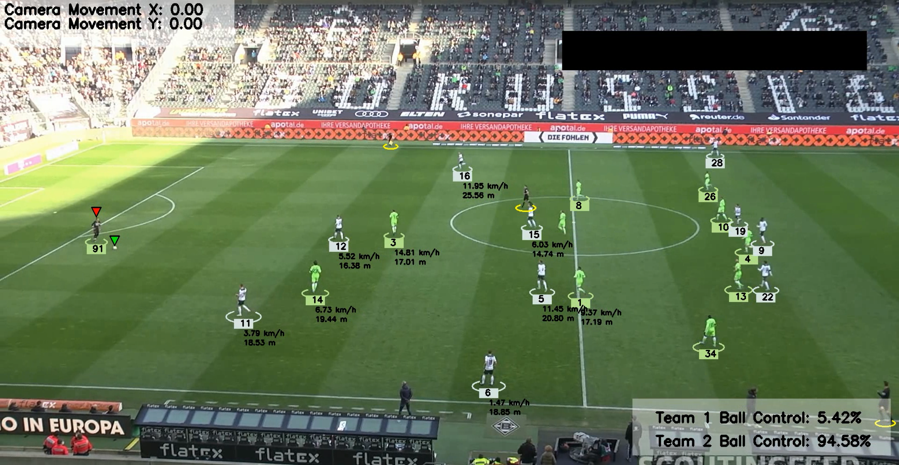

# Football Analysis Project

## Introduction
The goal of this project is to detect and track players, referees, and footballs in a video using YOLO, one of the best AI object detection models available. We will also train the model to improve its performance. Additionally, we will assign players to teams based on the colors of their t-shirts using Kmeans for pixel segmentation and clustering. With this information, we can measure a team's ball acquisition percentage in a match. We will also use optical flow to measure camera movement between frames, enabling us to accurately measure a player's movement. Furthermore, we will implement perspective transformation to represent the scene's depth and perspective, allowing us to measure a player's movement in meters rather than pixels. Finally, we will calculate a player's speed and the distance covered. This project covers various concepts and addresses real-world problems, making it suitable for both beginners and experienced machine learning engineers.



## Modules Used
The following modules are used in this project:
- YOLO: AI object detection model
- Kmeans: Pixel segmentation and clustering to detect t-shirt color
- Optical Flow: Measure camera movement
- Perspective Transformation: Represent scene depth and perspective
- Speed and distance calculation per player

## Trained Models
- [Trained Yolo v5](https://drive.google.com/file/d/1DC2kCygbBWUKheQ_9cFziCsYVSRw6axK/view?usp=sharing)

## Sample video
-  [Sample input video](https://drive.google.com/file/d/1t6agoqggZKx6thamUuPAIdN_1zR9v9S_/view?usp=sharing)

## Requirements
Python 3.9 or newer is recommended. Create an environment and install the dependencies:

```bash
python3 -m venv .venv
source .venv/bin/activate
python -m pip install --upgrade pip
python -m pip install -r requirements.txt
```

Download the trained model from the link above and save it as `models/best.pt`. Download
the sample video and save it as `input_videos/08fd33_4.mp4`.

## Run

From the project root, run:

```bash
python main.py
```

On Apple Silicon, MPS acceleration is selected automatically. You can configure it
explicitly and adjust the inference batch size:

```bash
python main.py --device mps --batch-size 32
```

The cached tracks in `stubs/` are used by default. If their coordinates do not match
the input video's resolution, the project automatically recomputes them. To explicitly
recompute the caches:

```bash
python main.py --input path/to/video.mp4 --no-stubs
```

Use `python main.py --help` to see options for the model, output, and cache paths.