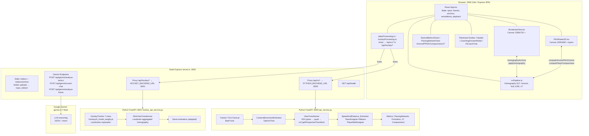

# Broadcast-to-Tactics: Automated Team Formation Analyzer — Complete Technical Overview

> **Version:** 0.0.0 | **Tagline:** *Computer vision pipeline that transforms 2D sports broadcast footage → 2D top-down coordinates, formation detection, Voronoi pitch control, passing networks, heatmaps & AI coaching insights.*  
> **Metadata:** `metadata.json:2` — *Broadcast-to-Tactics: Automated Team Formation Analyzer*  
> **AI Studio Link:** https://ai.studio/apps/95adeedf-be96-496b-a781-64292f94954d  
> **Generated:** 2026-09-02 — single source-of-truth end-to-end document.

---

## Table of Contents
1. [Executive Summary](#1-executive-summary)
2. [Key Capabilities & Sports Supported](#2-key-capabilities--sports-supported)
3. [Technology Stack](#3-technology-stack)
4. [High-Level Architecture](#4-high-level-architecture)
5. [Project Directory Structure](#5-project-directory-structure)
6. [Data Models & Type System](#6-data-models--type-system)
7. [Frontend — React + Vite Application](#7-frontend--react--vite-application)
   - 7.1 `src/App.tsx` — Orchestrator
   - 7.2 Component Catalogue
   - 7.3 Client-Side CV Pipeline (`src/services/cvPipeline.ts`)
   - 7.4 Synthetic Sample Data (`src/data/sampleMatches.ts`)
   - 7.5 Video Processing Services
8. [Backend — Node.js Express Proxy (`server.ts`)](#8-backend--nodejs-express-proxy-servers)
9. [Backend — Python Football CV Pipeline (`backend/api_service.py`)](#9-backend--python-football-cv-pipeline-backendapi_servicepy)
10. [Backend — Python Hockey CV Pipeline (`backend/hockey_api_service.py`)](#10-backend--python-hockey-cv-pipeline-backendhockey_api_servicepy)
11. [Archive 2 — Core CV Engine (Independent Module)](#11-archive-2--core-cv-engine-independent-module)
12. [End-to-End Data Flows](#12-end-to-end-data-flows)
13. [Homography, Voronoi, Compactness, xT & Heatmap Deep-Dives](#13-homography-voronoi-compactness-xt--heatmap-deep-dives)
14. [AI / Gemini Integration](#14-ai--gemini-integration)
15. [Build, Dev Server & Production Bundling](#15-build-dev-server--production-bundling)
16. [Startup Scripts & Local Development](#16-startup-scripts--local-development)
17. [Configuration, Environment & Secrets](#17-configuration-environment--secrets)
18. [Caching, Stubs & Performance](#18-caching-stubs--performance)
19. [API Reference](#19-api-reference)
20. [Verification, Limitations & Roadmap](#20-verification-limitations--roadmap)

---

## 1. Executive Summary

**Tactical Vision AI** is a dual-plane sports analytics platform:

- **Plane 1 — Broadcast View (2D perspective camera feed):** either a synthetic broadcast scene drawn on `<canvas>` or a real uploaded MP4 overlaid with YOLO bounding boxes, base rings, velocity vectors, ball/puck markers and coach telestrator drawings.
- **Plane 2 — Top-Down Radar (2D orthogonal pitch/rink/mat):** the broadcast coordinates are projected via a **4-point homography** (Direct Linear Transform + `cv2.getPerspectiveTransform`) into pitch-normalized `[0..100]` space and re-rendered with configurable analytics layers: *Radar, Voronoi pitch control, Passing Network, KDE Heatmap, Convex-Hull Compactness, Expected Threat (xT)*.

A **dual-backend** design isolates sports physics:

- **Football** → `backend/api_service.py` on `:8000` → `Archive 2/models/best.pt` (YOLOv8, 4 classes: `player`, `goalkeeper`, `referee`, `ball`).
- **Hockey** → `backend/hockey_api_service.py` on `:8001` → `HockeyAI_model_weight.pt` (YOLOv8, 7 classes: `centriod`, `faceoff`, `goal`, `goalie`, `player`, `puck`, `referee`).

A **Node.js Express proxy** (`server.ts:1`) on `:3000` unifies them under `/api/cv/*` and `/api/hockey/*`, serves the Vite SPA, proxies Gemini AI calls (`@google/genai`), and handles video uploads/static hosting. The React SPA (`src/App.tsx:43`) can run in **Sample Data mode** (procedurally generated frames) or **Real Data mode** (Python-inferred `MatchData`).

---

## 2. Key Capabilities & Sports Supported

| Capability | Description | Sport Specificity |
|---|---|---|
| **YOLO Detection + ByteTrack** | Frame-batched YOLO inference (`batch_size=16/32`) + `supervision.ByteTrack` identity persistence | Football 4-class, Hockey 7-class (incl. landmarks) |
| **Team Assignment** | `team_assigner:TeamAssigner` — KMeans on jersey-crop RGB (k=2) in first frame; nearest-centroid per player | Same logic, colors mapped to `teamA/teamB` hex |
| **Camera Motion Compensation** | `camera_movement_estimator:CameraMovementEstimator` — optical flow on masked green/ice, Lucas-Kanade | All sports |
| **Perspective Projection** | `view_transformer:ViewTransformer` (football) HSV grass mask + midfield-line Hough detection; `rink_transformer:RinkViewTransformer` (hockey) landmark aggregation | Separate implementations |
| **Speed & Distance** | `speed_and_distance_estimator:SpeedAndDistance_Estimator` — meters via pitch dimensions + fps | 105×68 m football, 61×30 m hockey, 13×10 m kabaddi |
| **Ball/Puck Interpolation** | Pandas `interpolate()` + `bfill`/`ffill` for missing `ball`/`puck` bboxes | `tracker.py:39`, `hockey_tracker.py:61` |
| **Tactical Metrics** | Possession, Voronoi pitch control, PPDA, compactness (convex hull), xT, formation, transitions | Backend & frontend compute both |
| **Telestrator** | Freehand/Arrow/Line/Circle/Spotlight/Zone annotations on broadcast canvas | Frontend only |
| **AI Coaching** | Gemini `gemini-3.7-flash` dossier + conversational coach + frame vision analyzer | `server.ts:217+` |

**Supported sports** (`src/types.ts:1`): `football` (11v11, 105×68 m, grass), `hockey` (6v6/11v11, 61×30 m ice **or** 91.4×55 m field), `kabaddi` (7v7, 13×10 m mat — sample-data only, no CV backend yet).

---

## 3. Technology Stack

| Layer | Tech | Version / Detail | File Evidence |
|---|---|---|---|
| **Frontend framework** | React | 19.0.1 + Vite 6.2.3 + `@vitejs/plugin-react` | `package.json:27`, `vite.config.ts:8` |
| **Styling** | Tailwind CSS | 4.1.14 + `@tailwindcss/vite` + `index.css:1` | `src/index.css`, `vite.config.ts:1` |
| **Language** | TypeScript | 5.8.2, `ES2022`, `bundler` resolution | `tsconfig.json:1` |
| **Canvas math** | d3-delaunay + D3 | Voronoi triangulation | `cvPipeline.ts:1`, `package.json:20` |
| **Icons** | lucide-react | 0.546.0 | All component imports |
| **Animation** | motion | 12.23.24 | `package.json:25` |
| **HTTP client** | axios | 1.6.2 + form-data 4.0.0 + multer 2.0.0 | `package.json:19`, `server.ts:7` |
| **Backend proxy** | Express | 4.21.2 + dotenv 17.2.3 | `server.ts:1`, `package.json:22` |
| **AI** | @google/genai | 2.4.0 → `gemini-3.7-flash` | `server.ts:5`, `package.json:15` |
| **Build** | Vite + esbuild + tsx | `vite build && esbuild server.ts --bundle` | `package.json:7` |
| **Python CV** | FastAPI 0.104.1 + Uvicorn 0.24.0 + Ultralytics 8.0.206 | YOLOv8 | `backend/requirements.txt:1` |
| **Vision deps** | opencv-python 4.8.1, torch 2.1.0, torchvision 0.16.0, supervision 0.16.0, scikit-learn, pandas | `backend/requirements.txt:5` |
| **Tracking** | supervision.ByteTrack | identity persistence | `tracker.py:26` |
| **Clustering** | sklearn KMeans | `team_assigner` jersey color | Archive 2 |
| **Node runtime** | tsx | `tsx server.ts` dev | `package.json:7` |

**Fonts:** `Plus Jakarta Sans` (UI) + `JetBrains Mono` (code) via `index.html:14` Google Fonts.  
**Project name quirk:** `package.json:2` still reads `"react-example"` (default Vite template).

---

## 4. High-Level Architecture



**Port allocation:**

| Service | Port | Entry Point | Process |
|---|---|---|---|
| **Node proxy + Vite SPA** | `3000` | `server.ts:19` / `npm run dev` | `tsx server.ts` (dev) or `node dist/server.cjs` (prod) |
| **Football FastAPI** | `8000` | `backend/api_service.py:964` | `venv/bin/python backend/api_service.py` |
| **Hockey FastAPI** | `8001` | `backend/hockey_api_service.py:952` | `venv/bin/python backend/hockey_api_service.py` |

**Request routing** (`server.ts:22`):

```
Browser --/api/cv/health-->       Node :3000 --axios--> Python :8000 /api/health
Browser --/api/hockey/health-->   Node :3000 --axios--> Python :8001 /api/hockey/health
Browser --/api/gemini/*-->        Node handles locally → @google/genai → Gemini API
Browser --/videos/*-->            Node static dirs: public/videos/, input_videos/, Archive 2/input_videos/
```

---

## 5. Project Directory Structure

```
tactical-vision-ai/
├── src/
│   ├── main.tsx                 # ReactDOM.createRoot(App)
│   ├── App.tsx                  # ★ Central orchestrator (668 LOC)
│   ├── types.ts                 # All domain interfaces
│   ├── index.css                # Tailwind + pitch themes
│   ├── components/
│   │   ├── Header.tsx           # Sport pill selector + video dropdown + calibration toggle
│   │   ├── BroadcastView.tsx    # Canvas 1280×720, video sync, YOLO bbox/ring/vector, telestrator, timeline
│   │   ├── PitchRadar2D.tsx     # Canvas 1000×650, 6 view modes, Voronoi/Hull/Heatmap/xT/Passing layers
│   │   ├── TacticalMetricsPanel.tsx # 4-card grid: Formation/Voronoi/Compactness/PPDA+xT
│   │   ├── PassingNetworkView.tsx    # Per-team graph table + metrics (passAccuracy/dominantChannel/directness)
│   │   ├── CoachingDossierModal.tsx  # AI report print view (Gemini dossier)
│   │   ├── AICoachChat.tsx      # Slide-over chat with quick-prompt chips
│   │   └── TelestratorToolbar.tsx   # Pen/Arrow/Line/Circle/Spotlight/Zone + color picker
│   ├── services/
│   │   ├── cvPipeline.ts        # Homography DLT, Voronoi, Hull, Heatmap KDE, formation, xT grid (443 LOC)
│   │   ├── videoProcessing.ts   # Football axios wrapper → /api/cv/*
│   │   └── hockeyProcessing.ts  # Hockey axios wrapper → /api/hockey/* (isolated)
│   └── data/
│       └── sampleMatches.ts     # Procedural generation for football/hockey/kabaddi (789 LOC)
├── backend/
│   ├── api_service.py           # Football FastAPI (964 LOC) — ports 8000
│   ├── hockey_api_service.py    # Hockey FastAPI (952 LOC) — port 8001, isolated
│   ├── requirements.txt         # FastAPI, ultralytics, torch, opencv, sklearn, pandas...
│   ├── cache/                   # Football match JSON cache (SHA256 keyed)
│   └── cache_hockey/            # Hockey match JSON cache
├── Archive 2/                   # ★ Standalone CV engine (original training project)
│   ├── main.py                  # CLI: python main.py --input ... --model ... --device mps
│   ├── trackers/
│   │   ├── tracker.py           # Tracker (football, 4 classes, 300 LOC)
│   │   └── hockey_tracker.py    # HockeyTracker (7 classes, landmarks, 351 LOC)
│   ├── view_transformer/
│   │   ├── view_transformer.py      # Football: HSV grass quad detection (188 LOC)
│   │   └── rink_transformer.py      # Hockey: ice + landmark homography (294 LOC)
│   ├── team_assigner/           # KMeans jersey color → team_id 1/2
│   ├── player_ball_assigner/    # Nearest-player bbox containment check
│   ├── camera_movement_estimator/ # Optical flow (Lucas-Kanade) + adjustment
│   ├── speed_and_distance_estimator/ # Speed capped at 30 km/h football / 42 hockey
│   ├── utils/                   # read_video, save_video, bbox helpers (get_center/foot)
│   ├── models/best.pt           # Football YOLOv8 weights (~22 MB)
│   ├── stubs/                   # pickled tracks & camera movement (track_stubs.pkl)
│   ├── input_videos/            # e.g. 08fd33_4.mp4 sample
│   └── output_videos/
├── HockeyAI_model_weight.pt     # ★ Hockey 7-class YOLOv8 weights (root level, ~YOLOv8m)
├── server.ts                    # Node Express proxy + Gemini + Vite middleware (440 LOC)
├── index.html                   # Vite entry, OG tags, fonts
├── vite.config.ts               # React + Tailwind plugins, HMR toggle, @ alias
├── tsconfig.json                # ES2022, bundler, paths @/*
├── package.json                 # Scripts: dev/build/start/preview/clean/lint
├── .env.example                 # GEMINI_API_KEY, APP_URL, PYTHON_BACKEND_URL
├── start.sh                     # Football + frontend launcher (ports 8000+3000)
├── start_hockey.sh              # Hockey launcher (port 8001)
├── input_videos/                # User-uploaded copies (mirrored to public/videos/)
├── public/videos/               # Static served at /videos/*
├── output_videos/               # python main.py rendered annotated video
└── venv/                        # Python virtualenv (local)
```

**Key note:** `HockeyAI_model_weight.pt:1` lives at project root (not `Archive 2/models/`); `hockey_api_service.py:55` checks both `HockeyAI_model_weight.pt` and fallback `Archive 2/models/hockey.pt`.

---

## 6. Data Models & Type System

**Source** `src/types.ts:1` (163 LOC) — single source of truth, shared across synthetic and real data paths.

```typescript
// src/types.ts:1 — Supported sports
type SportType = 'football' | 'hockey' | 'kabaddi';

// src/types.ts:3 — All positions normalized to 0..100 (both screen % and pitch %)
interface Point2D { x: number; y: number; }
interface BoundingBox { x: number; y: number; w: number; h: number; }

// src/types.ts:15 — Role expands for kabaddi
type EntityRole = 'goalkeeper'|'defender'|'midfielder'|'forward'
                | 'raider'|'corner'|'cover'|'in_out'|'referee'|'ball'|'puck';

// src/types.ts:17 — Per-player entity
interface DetectedEntity {
  id: string;              // "teamA_7" or "H_A3" (track_id encoded)
  name: string;            // "Dias" or "Player 7"
  jerseyNumber?: number;    // track_id % 99
  team: 'teamA'|'teamB'|'neutral';
  role: EntityRole;        // inferred by x-distribution or YOLO goalie flag
  confidence: number;
  bbox: BoundingBox;       // screen % [x,y,w,h]
  screenPos: Point2D;      // foot anchor (formation entity) or center (ball/puck)
  pitchPos: Point2D;       // homography-projected top-down [0..100]
  velocity: Point2D;       // pitch delta per frame
  speedKmh: number;
  distanceCoveredMeters: number;
  hasPossession?: boolean; // has_ball / has_puck
}

// src/types.ts:33
interface FrameData {
  frameIndex: number;
  timestampSec: number;
  timeDisplay: string;     // "02:14"
  entities: DetectedEntity[];
  ballPos: Point2D|null;   // pitch space
  ballScreenPos?: Point2D|null; // screen % with fallback puck fields puckPos/puckScreenPos for hockey
  possessionTeam: 'teamA'|'teamB'|'neutral';
  possessionPlayerId: string|null;
  phase: 'build_up'|'high_press'|'counter_attack'|'raid_defense'|'settled_defense'|'transitional'|'offensive_zone'|...;
  eventTag?: string;       // "CV possession transfer"
  homographyCalibration: Point2D[]; // 4 corners from ViewTransformer.get_calibration_percentages()
}

// src/types.ts:47 — Team branding
interface TeamConfig {
  id: string; name: string; shortName: string;
  primaryColor: string; secondaryColor: string; textColor: string;
  formation: string; sport: SportType;
}

// src/types.ts:67 — Graph
interface PassingNetworkData {
  nodes: { id:string; name:string; jerseyNumber:number; avgPitchPos:Point2D; touches:number;
           centrality:number; role:EntityRole; team:'teamA'|'teamB' }[];
  edges: PassConnection[]; // count + successRate + avgDistanceMeters + xThreatGained
  dominantChannnel: string; // note typo preserved: dominantChannnel → also dominantChannel duplicate
  passAccuracy: number; directnessIndex: number;
}

// src/types.ts:84
interface TacticalMetrics {
  possessionA/B, pitchControlA/B, ppdaTeamA/B,
  compactnessA/B: {lineDepthMeters, teamWidthMeters, convexHullAreaSqM},
  expectedThreatTeamA/B, defensiveTransitionsCount, keyRecoveryZonesCount,
  detectedFormationA/B
}

// src/types.ts:109 — Gemini output shape
interface AIReportData {
  tacticalSummary: string;
  structuralStrengths: string[]; tacticalVulnerabilities: string[];
  coachingDirectives: string[]; counterStrategy: string;
  recommendedDrill: {title,duration,intensity,objective,instructions}
}

// src/types.ts:133 — Pitch metadata
interface SportDimension {
  name: string; lengthMeters, widthMeters, pitchRatio: number;
  surfaceTheme: 'grass'|'ice'|'mat';
  landmarks: {name:string; pitchPos:Point2D}[]; // e.g. Center Circle 50,50
}

// src/types.ts:145 — Match = full telemetry bundle
type MatchData = SampleMatch; // id,name,sport,description,teamA/B,durationSec,fps,frames[],passingNetworkA/B,baseMetrics,dimension
```

**Python → TypeScript contract:** `backend/api_service.py:833` / `hockey_api_service.py:819` emit exactly `MatchData` JSON (snake→camel handled in Python dict literals). Fields like `puckPos` are unioned to `ballPos` for frontend compatibility (`BroadcastView.tsx:197`). `dominantChannnel` typo is handled by emitting both keys (`api_service.py:489`).

---

## 7. Frontend — React + Vite Application

### 7.1 `src/App.tsx` — Central Orchestrator (668 LOC)

**State topology** `src/App.tsx:43`:

```typescript
// Active sport & data source
const [currentSport, setCurrentSport] = useState<SportType>('football'); // football|hockey|kabaddi
const [useRealData, setUseRealData] = useState(false);
const [realMatchData, setRealMatchData] = useState<MatchData|null>(null);
const matchData = useMemo(() => useRealData && realMatchData ? realMatchData : SAMPLE_MATCHES[currentSport], [...]);

// Playback
const [currentFrameIndex, setCurrentFrameIndex] = useState(0);
const [isPlaying, setIsPlaying] = useState(true);
const [playbackSpeed, setPlaybackSpeed] = useState(1.0); // 0.25,0.5,1.0,2.0

// Homography calibration
const [isCalibrating, setIsCalibrating] = useState(false);
const [homographyAnchors, setHomographyAnchors] = useState<Point2D[]>(matchData.frames[0].homographyCalibration);

// Telestrator / selection / video upload
const [telestratorTool, setTelestratorTool] = useState<TelestratorTool>('select');
const [telestratorColor, setTelestratorColor] = useState('#fbbf24');
const [annotations, setAnnotations] = useState<DrawingAnnotation[]>([]);
const [selectedEntityId, setSelectedEntityId] = useState<string|null>(null);
const [customVideoUrl, setCustomVideoUrl] = useState<string|null>(null); // /videos/<filename> or blob URL
const [availableVideos, setAvailableVideos] = useState<VideoItem[]>([]);

// Modals & AI
const [isReportModalOpen, setIsReportModalOpen] = useState(false);
const [reportData, setReportData] = useState<AIReportData|null>(null);
const [isProcessingVideo, setIsProcessingVideo] = useState(false);
const [processingError, setProcessingError] = useState<string|null>(null);
```

**Core computed values** — all `useMemo` to avoid per-render CV recompute:

- **`currentFrame`** `App.tsx:113`: applies `computeHomography(homographyAnchors, [0,0→100,100])` + `applyHomography(matrix, e.screenPos)` when in sample mode; bypasses if `useRealData && !isCalibrating` (already transformed by Python).
- **`voronoiResult`** `App.tsx:142`: `computeVoronoiPitchControl(currentFrame.entities)` → `{cells, pitchControlA/B}`.
- **`compactnessA/B`** `App.tsx:148`: `computeTeamCompactness(currentFrame.entities, team, lengthMeters, widthMeters)`.

**Playback engine** `App.tsx:165`:

- **Custom video path** (`customVideoUrl` truthy): video element drives `currentFrameIndex` via `requestAnimationFrame` sampling `video.currentTime / video.duration` (`BroadcastView.tsx:106`). Timer loop is disabled (`if (customVideoUrl) return`).
- **Synthetic path** (`customVideoUrl` falsy): `setInterval(intervalMs = 1000 / (fps * playbackSpeed))` cycles `currentFrameIndex % frames.length`. For sample football `fps:2.5`, at `1×` interval = 400 ms.

**Keyboard shortcuts** `App.tsx:180`: `Space` toggle play, `ArrowLeft/Right` step, `c` toggle calibration, `Esc` close overlays.

**Video handlers** — intentionally isolated sport routes:

```typescript
// App.tsx:239 — Football preset (UNCHANGED)
handleSelectPresetVideo(filename) → videoProcessingService.processUploadedVideo → setRealMatchData+setCustomVideoUrl(`/videos/${filename}`)

// App.tsx:275 — Football upload
handleVideoUpload(file) → videoProcessingService.uploadVideo → processUploadedVideo

// App.tsx:319 — Hockey preset (NEW SEPARATE)
handleHockeySelectPresetVideo → hockeyProcessingService.processUploadedVideo → sport='hockey'

// App.tsx:356 — Hockey upload
handleHockeyVideoUpload → hockeyProcessingService...

// App.tsx:399 — Unified router called by Header
handleSelectPresetVideoUnified → if(currentSport==='hockey') hockey else football
```

**AI report fetcher** `App.tsx:207`: `fetch('/api/gemini/analyze-tactics', {sport, metrics, passingNetworkA/B, teamA/B})`.

**Render tree** `App.tsx:424`: `Header` → `TelestratorToolbar` → 2-column grid `BroadcastView | PitchRadar2D` → `TacticalMetricsPanel` → `PassingNetworkView` → Guidance banner + processing/error banners → `CoachingDossierModal` → `AICoachChat`.

---

### 7.2 Component Catalogue

#### `src/components/Header.tsx` (237 LOC)
- **Branding:** emerald→cyan gradient icon, match name, `YOLO Real Telemetry` vs `CV Radar` live badge (`Header.tsx:73`).
- **Sport pills** `Header.tsx:88`: `football|hockey|kabaddi`; switching while `useRealData` auto-toggles off.
- **Video dropdown** `Header.tsx:117`: lists `availableVideos` (from `GET /api/cv/videos` on mount `App.tsx:94`) with per-file `Analyze` button → `onSelectPresetVideo`, `Upload Custom MP4 Video` hidden `<input type=file>`.
- **Calibration toggle** `Header.tsx:193`, **Coaching Report** `Header.tsx:210`, **AI Tactical Coach** `Header.tsx:221`.

#### `src/components/BroadcastView.tsx` (927 LOC)
- **Props:** `currentFrame, allFrames, currentFrameIndex, isPlaying, playbackSpeed, homographyAnchors, annotations, customVideoUrl`.
- **State:** `showBBoxes, showLabels, showVectors, showHomographyGrid` layer toggles + `isDrawing, currentPoints, draggingAnchorIndex`.
- **Effects:**
  1. `useEffect:89` — sets `video.playbackRate` + play/pause.
  2. `useEffect:101` — `requestAnimationFrame` sync: `frameIdx = floor((video.currentTime/duration)*totalFrames)`.
  3. `useEffect:141` — when paused & slider scrubbed, seeks `video.currentTime = (idx/totalFrames)*duration`.
  4. `useEffect:158` — main canvas repaint: clears → `drawSyntheticBroadcastScene` (if no `customVideoUrl`) → `drawHomographyGridOverlay` → `drawDetectedEntities` → `drawBall` → telestrator annotations.
- **Canvas layout:** outer `relative aspect-video` with absolutely positioned `<video>` behind `<canvas 1280×720>`.
- **Interaction** `BroadcastView.tsx:250`: `getCanvasCoords` (viewport→[0..100]), hit-tests anchors (radius 4%) and entities (radius 4%), handles `telestratorTool==='select'` picking vs drawing modes.
- **Helpers** (bottom of file):
  - `drawSyntheticBroadcastScene(539)`: football → perspective grass + mown strips + white lines + center ellipse; hockey → ice gradient + red/blue lines; kabaddi → mat + Mid/Baulk/Bonus lines.
  - `drawHomographyGridOverlay(658)`: trapezoid + 4 internal grid lines + draggable numbered handles when calibrating.
  - `drawDetectedEntities(733)`: per-entity bbox + corner accents + base ellipse + velocity cyan vector + label badge; possession glows amber.
  - `drawBall(823)`: white ball vs black puck with shadow + glow.
  - `drawSingleAnnotation(851)`: `freehand|line|arrow|circle|spotlight|zone`.

#### `src/components/PitchRadar2D.tsx` (782 LOC)
- **State:** `viewMode: 'radar'|'voronoi'|'passing'|'heatmap'|'hull'|'xt'` (default `radar`), `heatmapTarget: 'all'|'teamA'|'teamB'|'selected'`.
- **Derived:** `voronoiResult, compactnessA/B, heatmapData (KDE)`, all `useMemo`.
- **Canvas 1000×650** `PitchRadar2D.tsx:103`: `drawPitchBackground` → active layer → `drawPitchMarkings` → `drawRadarPlayers` → `drawRadarBall`.
- **View-mode layers:**
  - `voronoi(480)`: translucent per-cell fills + 40% stroke, totals to `pitchControlA/B`.
  - `heatmap(508)`: Cyan→Lime→Yellow→Red mapping over KDE grid.
  - `hull(556)`: per-team convex hull fills (`${color}2a`).
  - `xt(586)`: `XT_PITCH_GRID` red gradient with value labels.
  - `passing(621)`: nodes sized by `centrality` + directed edges with arrowheads.
- **Click picking** `PitchRadar2D.tsx:167`: `dist<5%` pitch-space hit test.
- **HUD:** selected player card (speed/distance/pitch coord/possession) + Voronoi legend bar.

#### `src/components/TacticalMetricsPanel.tsx` (194 LOC)
Four cards grid (`md:2 / lg:4`):
1. **Formation Detection** — per-team `detectedFormationA/B` chips + phase pill `phase.replace('_',' ')`.
2. **Spatial Pitch Control** — dual bar `pitchControlA/B`, possession context.
3. **Team Compactness** — `convexHullAreaSqM`, `lineDepthMeters`, `teamWidthMeters` per team.
4. **PPDA & Threat Index** — `ppdaTeamA` aggressiveness label (`<9 High Aggression else Mid Block`) + `expectedThreatTeamA` Zone-14 note.

#### `src/components/PassingNetworkView.tsx` (189 LOC)
Team tab switcher (`teamA|teamB`), four top-line metrics: `passAccuracy`, `dominantChannnel`, `directnessIndex`, playmaker (top `touches`). Two sub-panels: Top 5 `edges` (by count) with `xT` gain + scrollable centrality list with bar.

#### `src/components/CoachingDossierModal.tsx` (281 LOC)
Fixed overlay with print-friendly modifiers (`print:*` Tailwind group). Header with `Re-Generate with AI` + `Print/PDF` (→ `window.print()`). Body shows loading spinner vs dossier: 4 mini telemetry cards, tactical summary, 2-column strengths/vulnerabilities, numbered directives, counter-strategy, gradient training-drill card.

#### `src/components/AICoachChat.tsx` (268 LOC)
Right-side `fixed inset-y-0 right-0 sm:w-[420px]` panel. Auto-welcome message injecting `teamA/B`, `formationA`, `pitchControlA`. `quickPrompts` array bound to metrics. Chat loop `POST /api/gemini/coach-chat {message, context}`, fallback local heuristic on error. Message bubbles differentiated by `role`, auto-scroll via `messagesEndRef`.

#### `src/components/TelestratorToolbar.tsx` (144 LOC)
Tools array including `freehand|arrow|line|circle|spotlight|zone`, color dots (`#fbbf24/#22d3ee/#34d399/#f87171/#ffffff`), `Eye/EyeOff` visibility, `RotateCcw` undo, `Trash2` clear — all per `currentTool`/`currentColor`.

---

### 7.3 Client-Side CV Pipeline — `src/services/cvPipeline.ts` (443 LOC)

#### 1. Homography (DLT + Gaussian elimination) — `cvPipeline.ts:18`
```typescript
computeHomography(src:Point2D[4], dst:Point2D[4]) → Matrix3x3
 // builds 8×8 system A*h=b (src → dst, -x*X, -y*X terms) → partial-pivot Gauss → back-sub → [h0..h7,1]
applyHomography(H, pt) // perspective divide denom=H20*x+H21*y+H22, clamp [0..100]
invertMatrix3x3(M)     // adjugate/det method
```
Fallback identity matrix if `<4` points. Used live: `App.tsx:120` transforms `e.screenPos → e.pitchPos`.

#### 2. Voronoi pitch control — `cvPipeline.ts:147`
- Filter `teamA|teamB` players, jitter `idx*0.001` to avoid co-linearity.
- `Delaunay.from(points).voronoi([0,0,100,100])` → per-cell polygon → Shoelace area → `areaPercent`; accumulates `areaA` vs `areaB` → `pitchControlA/B`.

#### 3. Convex hull & compactness — `cvPipeline.ts:217`
- Monotone chain `computeConvexHull` (sorted `x` then `y`, cross-product pruning).
- `computeTeamCompactness(team, pitchLength, pitchWidth)`: excludes `goalkeeper`, requires ≥3 outfield; bounding box `lineDepthMeters = (maxX-minX)/100*length`, `teamWidthMeters = (maxY-minY)/100*width`, shoelace hull `convexHullAreaSqM`. Returns `{lineDepth, teamWidth, convexHullArea, hullPoints}`.

#### 4. KDE Heatmap — `cvPipeline.ts:297`
- `computeSpatialHeatmapGrid(points, gridCols=60, gridRows=40, bandwidth=6.5)` — Gaussian kernel `exp(-distSq/(2*σ²))` summed per cell, normalized by `maxDensity`.

#### 5. Formation recognition — `cvPipeline.ts:347`
- Sport-branched: `kabaddi` → 2-1-2/2-2-2 thresholds; `hockey` → `1-3-1` vs `3-3-2-2`; `football` → sort outfield by `pitchPos.x` (teamA forward=increasing x, teamB mirrored), compute `min..max` range, bin `relX<0.35 → defenders`, `<0.72 → midfielders`, else forwards → matches `4-3-3 Holding`, `4-2-3-1 Fluid`, `4-4-2 Mid-Block`, `3-5-2 Wingback`, `5-3-2 Low Block`, `3-4-3 Overload`, else `d-b-f`.

#### 6. Expected Threat grid — `cvPipeline.ts:414`
- `XT_PITCH_GRID` 8×16 (highest 0.94 near penalty box center; mirrored for `teamB` via `cols-1-colIdx`). `getExpectedThreat(pos, team)` quantizes `pos.x/y` → cell lookup.

All these run **per frame** on the frontend for synthetic data; Python backends run equivalent logic server-side and embed the results in `baseMetrics`.

---

### 7.4 Synthetic Sample Data — `src/data/sampleMatches.ts` (789 LOC)

Three procedural generators:

**Football** `generateFootballFrames(): 45 frames` (`sampleMatches.ts:42`):
- 11v11 + referee; Team A Sky Blues `4-3-3 (3-2-4-1 build-up)` sky `#0ea5e9` vs Team B Royal Madrid `4-4-2 Mid-Block` red `#ef4444`.
- Per-frame `t=i/totalFrames`, ball arc `ballX=35+40*t+4*sin(6t)`, `ballY=48+22*sin(4t)`; homography wobble `sin(2t)`; passing phases `A6 Rodri <15`, `A8 De Bruyne 15-30`, `A11 Haaland ≥30` with event tags line-breaking → through-ball → recovery press.

**Hockey** `generateHockeyFrames(): 35 frames` (`sampleMatches.ts:309`):
- 5+6 players puck possession `H_A2 Makar <12 → H_A3 Rantanen 12-24 → H_A6 Landeskog ≥24`; formations `1-3-1 Power Play` vs `2-1-2 Box Trap`.

**Kabaddi** `generateKabaddiFrames(): 30 frames` (`sampleMatches.ts:383`):
- 1 raider `Sachin (teamB)` advancing `raiderX=52+28*t` across Baulk/Bonus vs 7-man defensive arc `Saurabh…Aman`; raider `hasPossession=true` permanent.

Each match exports (`sampleMatches.ts:554`) `SAMPLE_MATCHES: Record<SportType, SampleMatch>` with duration 12-18s, fps 2.5, full passing networks (centrality/touches), metrics (possession 64/36 football, 72/28 hockey), dimensions, and theme keys.

---

### 7.5 Video Processing Services

#### `src/services/videoProcessing.ts` (109 LOC) — Football
```typescript
class VideoProcessingService {
  checkHealth()  → GET  /api/cv/health
  listVideos()   → GET  /api/cv/videos
  uploadVideo(file) → POST /api/cv/upload-video (FormData file) → {filename, public_url}
  processVideo(req) → POST /api/cv/process-video {video_path, use_stubs, use_cache, batch_size, device}
  processUploadedVideo(filename) → {video_path:filename, use_stubs:false, use_cache:true, batch_size:16, device:'auto'}
}
export const videoProcessingService = new VideoProcessingService();
```

#### `src/services/hockeyProcessing.ts` (113 LOC) — Hockey (isolated)
Identical API but under `/api/hockey/*`:
```typescript
class HockeyProcessingService {
  checkHealth()  → GET  /api/hockey/health
  listVideos()   → GET  /api/hockey/videos
  uploadVideo(file) → POST /api/hockey/upload-video → filename=hockey_upload_*
  processVideo(req) → POST /api/hockey/process-video
}
export const hockeyProcessingService = new HockeyProcessingService();
```
Explicitly documented as *COMPLETELY SEPARATE FROM FOOTBALL* (file header comment).

Both are consumed via the unified wrappers in `App.tsx:399` that route by `currentSport`.

---

## 8. Backend — Node.js Express Proxy (`server.ts`)

> **File:** `server.ts:1` (440 LOC) — single Node process that **both proxies Python CV** and **hosts Gemini AI**, then serves the Vite app.

**Boot** `server.ts:420`:
- `dotenv.config()` loads `GEMINI_API_KEY`, `PYTHON_BACKEND_URL` (default `http://localhost:8000`), `HOCKEY_BACKEND_URL` (default `http://localhost:8001`) (`server.ts:21`).
- `PORT=3000` fixed (`server.ts:19`), `express.json({limit:'50mb'})` + `urlencoded`.
- Creates `input_videos/`, `public/videos/` if missing (`server.ts:33`).
- Static mounts: `express.static(public/videos)` → `/videos/*`, `express.static(input_videos)` → `/videos/*`, `express.static(Archive 2/input_videos)` → `/videos/archive/*` (`server.ts:36`).
- **Multer** `server.ts:41` disk storage `destination=input_videos`, filename sanitized `${Date.now()}_${clean}`.

**Lazy GenAI client** `getGenAI():44`:
- Warns if `GEMINI_API_KEY` missing, constructs `new GoogleGenAI({apiKey: apiKey||'dummy-key', httpOptions:{headers:{'User-Agent':'aistudio-build'}}})`.
- Missing key triggers **local heuristic fallbacks** (deterministic strings) rather than failing — keeps demo usable offline.

**Routes (table):**

| Method | Path | Handler | Logic (`server.ts:line`) |
|---|---|---|---|
| `GET` | `/api/health` | inline | returns `{status, timestamp, aiConfigured, pythonBackend}` — `73` |
| `GET` | `/api/cv/health` | proxy | `axios.get(PYTHON_BACKEND_URL/api/health)` — `83` |
| `GET` | `/api/cv/videos` | proxy | `axios.get(PYTHON_BACKEND_URL/api/videos)` — `95` |
| `POST` | `/api/cv/upload-video` | multer + proxy | saves file + `copyFileSync→public/videos` → returns `{filename, public_url:/videos/<f>}` — `107` |
| `POST` | `/api/cv/process-video` | proxy | `axios.post(PYTHON_URL/api/process-video, req.body, {timeout:900000})` 15 min — `129` |
| `GET` | `/api/hockey/health` | hockey proxy | `GET HOCKEY_BACKEND_URL/api/hockey/health` — `147` |
| `GET` | `/api/hockey/videos` | hockey proxy | `GET HOCKEY_BACKEND_URL/api/hockey/videos` — `159` |
| `POST` | `/api/hockey/upload-video` | multer | same save+mirror + best-effort `FormData` forward to hockey backend — `171` |
| `POST` | `/api/hockey/process-video` | hockey proxy | `POST HOCKEY_BACKEND_URL/api/hockey/process-video` — `200` |
| `POST` | `/api/gemini/analyze-tactics` | LLM or fallback | see §14 — `217` |
| `POST` | `/api/gemini/coach-chat` | LLM or fallback | — `322` |
| `POST` | `/api/gemini/analyze-frame` | vision LLM | base64 image + sport — `372` |

**Vite integration** `startServer():420`:
- Development (`NODE_ENV !== 'production'`): `createViteServer({server:{middlewareMode:true}, appType:'spa'})` + `app.use(vite.middlewares)` — hot middleware, HMR controlled by `DISABLE_HMR` env (`vite.config.ts:17`).
- Production: `express.static(dist)` + `GET * → dist/index.html` SPA fallback (after `vite build` outputs `dist/`). Production bundle: `package.json:8` → `esbuild server.ts --bundle --platform=node --format=cjs --packages=external`.

**Error handling:** proxy routes catch `error.response?.data?.detail || error.message` and return `500 {error, details}` (so frontend shows `processingError` banner).

---

## 9. Backend — Python Football CV Pipeline (`backend/api_service.py`)

> **File:** `backend/api_service.py:1` (964 LOC) — FastAPI `:8000`. Thin orchestration over `Archive 2/` CV engine, adds match-cache, type coercion, and UI-serializable output.

### 9.1 Module wiring (`api_service.py:18`)

```python
base_dir = dirname(dirname(abspath(__file__)))  # project root
archive2_path = join(base_dir, 'Archive 2')
sys.path.insert(0, archive2_path)
from trackers import Tracker
from team_assigner import TeamAssigner
from player_ball_assigner import PlayerBallAssigner
from camera_movement_estimator import CameraMovementEstimator
from view_transformer import ViewTransformer
from speed_and_distance_estimator import SpeedAndDistance_Estimator
from utils import read_video, save_video
```

### 9.2 Constants & storage (`api_service.py:49`)

| Constant | Value | Purpose |
|---|---|---|
| `VIDEO_INPUT_DIR` | `input_videos/` | user uploads, preset videos |
| `ARCHIVE2_INPUT_DIR` | `Archive 2/input_videos/` | sample e.g. `08fd33_4.mp4` |
| `MODEL_PATH` | `Archive 2/models/best.pt` | YOLOv8 weights |
| `TRACK_STUB_PATH` | `Archive 2/stubs/track_stubs.pkl` | legacy single stub |
| `CAMERA_STUB_PATH` | `Archive 2/stubs/camera_movement_stub.pkl` | camera flow stub |
| `MATCH_CACHE_DIR` | `backend/cache/` | JSON SHA-hashed match cache |
| `MATCH_CACHE_VERSION` | `match-cache-v3-visible-pitch-window` | cache invalidation key |

Per-video stubs (`get_video_stub_paths:108`) are `<stub_dir>/<safe_stem>_tracks.pkl` + `_camera.pkl`.  
Match cache key (`get_match_cache_path:118`): SHA256 of `{version, videoAbs, videoSize, videoMtime, modelAbs, modelSize, modelMtime}` truncated 24 chars + safe stem prefix.

### 9.3 Helper functions (the analytics library)

| Function | Lines | What it does |
|---|---|---|
| `convert_to_python_types:73` | `api_service.py:73` | Recursively normalizes `np.integer/floating/bool_/ndarray` → native Python (plus NaN/Inf → 0.0) for JSON. |
| `resolve_video_path:93` | `93` | Tries 5 candidates (`video_path`, `base_dir/video_path`, `input_videos/basenm`, `Archive2/...`, `public/videos/basenm`). Raises `FileNotFoundError` listing checked paths. |
| `convert_bbox_to_percentage:136` | `136` | `[x1,y1,x2,y2] px → {x,y,w,h}%` (`/frameWidth*100`). |
| `convert_position_to_percentage:147` | `147` | `[x,y] px → {x,y}%`. |
| `transform_to_pitch_coordinates:156` | `156` | Uses `position_transformed` (homography) if non-NaN, else fallback `px=8+(sx/fw)*45, py=5+(sy/fh)*90`, clamp `[0..100]`/`[4..96]`. |
| `calculate_compactness:178` | `178` | Per-frame `pts` of players excluding `goalkeeper`; median over frames → `lineDepthMeters, teamWidthMeters, convexHullAreaSqM`. |
| `calculate_pitch_control:204` | `204` | Grid `20×14` sampled every ~1/150 frames; distance-to-nearest player per grid cell → `pitchControlA/B` mean. |
| `summarize_xt:237` | `237` | Iterates `possessionPlayerId` transfers; `xt = Σ max(0, xtAfter-xtBefore)` per team using `get_xt_val`. |
| `classify_phase:267` | `267` | Uses `avg_x` of possession team (mirrored for `teamB`) vs opponent `opp_avg_x`: `>58 & opp>50 → high_press`, `>67 → counter_attack`, `<40 → build_up`, else `transitional`. |
| `get_xt_val:306` | `306` | Maps `pitchPos` to `XT_GRID` (8×16) with mirroring for `teamB`. `XT_GRID` peaks at 0.94 in penalty spot (`api_service.py:294`). |
| `calculate_real_passing_network:318` | `318` | **Graph inference from possession time series.** Collects per-player `team_entities, player_positions, player_touches` counting `possessionPlayerId` changes within same team; detects `pass_events` on consecutive-frame `current_passer != new_possession`; aggregates `edge_map` (count/totalDist/totalXt), extracts dominant channel (`Left Wing…Right Wing` by `destY`), `directnessIndex=forward/total*100`, keeps top-14 players by frequency+touches. |
| `detect_team_formation_from_nodes:495` | `495` | Sorts `avgPitchPos.x` (reversed for `teamB`), bins `rel<0.35 → defenders, <0.72 → mid, else forwards` → `4-3-3 / 4-4-2 / 3-5-2 / 4-2-3-1 / 5-3-2` else `d-m-f`. |

### 9.4 Core pipeline `process_video_to_match_data:530` (345 LOC — the heart)

**Step-by-step data flow:**

```python
resolved_path = resolve_video_path(video_path)           # L531
cache_path = get_match_cache_path(resolved_path)         # L536
if use_cache and exists(cache_path): return cached       # L538 fast path

video_frames = read_video(resolved_path)                 # L544 (utils: cv2.VideoCapture loop)
fps = VideoCapture(resolved).get(CAP_PROP_FPS) or 25.0  # L548
h,w = video_frames[0].shape[:2]

tracker = Tracker(MODEL_PATH, batch_size=32, device='auto')     # L554
tracks  = tracker.get_object_tracks(frames, read_from_stub=use_stubs, stub_path=track_stub)  # L556
tracker.add_position_to_tracks(tracks)                            # L562 gets footPos(center) or center
camera_estimator = CameraMovementEstimator(video_frames[0])       # L564
cam_per_frame    = camera_estimator.get_camera_movement(frames, read_from_stub, camera_stub) # L565
camera_estimator.add_adjust_positions_to_tracks(tracks, cam_per_frame) # L569 subtract camera flow
view_transformer = ViewTransformer(video_frames[0])              # L571 HSV quad detection
view_transformer.add_transformed_position_to_tracks(tracks)      # L572 perspectiveTransform per position
tracks["ball"] = tracker.interpolate_ball_positions(tracks["ball"]) # L574 pandas interpolation
tracker.add_position_to_tracks({"ball": tracks["ball"]})         # copy position for ball too
view_transformer.add_transformed_position_to_tracks({"ball":...}) # transform ball too
speed_est = SpeedAndDistance_Estimator(frame_rate=fps, 105, 68)  # L579
speed_est.add_speed_and_distance_to_tracks(tracks)               # L584 capped 0-~30 km/h
team_assigner = TeamAssigner()                                   # L586
team_assigner.assign_team_color(video_frames[0], tracks['players'][0]) # L588 KMeans on crops
for frame_num, player_track in enumerate(tracks['players']):     # L592 iterate every player every frame
    team = team_assigner.get_player_team(frame, bbox, id)        # L594 nearest centroid
    tracks['players'][...]['team']=team                           # L599 1|2
player_assigner = PlayerBallAssigner()                            # L602
team_ball_control = [] targets per frame
for frame_num, player_track ...:
    ball_bbox = tracks['ball'][frame_num].get(1,{}).get('bbox') # L605
    assigned = player_assigner.assign_ball_to_player(player_track, ball_bbox) # L610 distance threshold ~70px
    tracks[...][assigned]['has_ball']=True; team_ball_control.append(team)
# Role inference  (L619-648): avg pitchPos.x per player per team → sorted → first = goalkeeper,
# remaining ratio <=0.45 defender, <=0.8 midfielder else forward
# Per-frame entity construction (L654-761): bbox→%, screen% , pitch% via transform, velocity deltas,
# ball existence guard, possession detection via has_ball flag, ViewTransformer calibration %
# (get_calibration_percentages), phase classify, eventTag "CV possession transfer" on same-team carrier swap
passing_network_a = calculate_real_passing_network(frames_data, 'teamA') # L762
passing_network_b = calculate_real_passing_network(frames_data, 'teamB')
formation_a/b    = detect_team_formation_from_nodes(nodes, is_team_b)    # L765
possession_pct   = team_a_frames / controlled_total *100                  # L771
pitch_control    = calculate_pitch_control(frames_data)                   # L776
compactness_a/b  = calculate_compactness(frames_data, team)               # L777
xt_summary       = summarize_xt(frames_data)                               # L779
defTransitions   = count team flips across frames                          # L780
keyRecoveries    = count eventTag transfers                                # L788
baseMetrics dict built (L790-810) with ppda = total_passes_opponent / max(1,defTransitions)
team colors rgb→hex via rgb_to_hex (L812)
dimension {length=105,width=68, landmarks(16.5,83.5)}                      # L820
result dict assembled (L833-866) including teamA/B configs, passingNetworkA/B, baseMetrics
result = convert_to_python_types(result); if use_cache: dump(cache_path) # L868
return result
```

### 9.5 Endpoints (`api_service.py:877`):

| Method | Path | Request | Response |
|---|---|---|---|
| `POST` | `/api/process-video` | `VideoProcessRequest {video_path, use_stubs, use_cache, batch_size, device}` | `MatchData` JSON (status 404/500 on error) — `877` |
| `POST` | `/api/upload-video` | `multipart File` | `{success, video_path, filename, public_url:/videos/<f>}` mirrored to `public/videos` for `video.js` playback — `898` |
| `GET` | `/api/videos` | — | `{videos:[{filename,path,size,public_url}]}` deduped across `VIDEO_INPUT_DIR`+`ARCHIVE2_INPUT_DIR` — `925` |
| `GET` | `/api/health` | — | `{status:healthy, model_exists, input_dir_exists, output_dir_exists}` — `951` |

Run: `if __name__=="__main__": uvicorn.run(app, host="0.0.0.0", port=8000)` (`api_service.py:962`).

---

## 10. Backend — Python Hockey CV Pipeline (`backend/hockey_api_service.py`)

> **File:** `backend/hockey_api_service.py:1` (952 LOC) — **fully separate** from football (`server.ts:146` routes isolate it). Rink-aware tracking and analytics.

### Differences vs Football

| Aspect | Football | Hockey |
|---|---|---|
| **Model** | `Archive 2/models/best.pt` 4 classes | `HockeyAI_model_weight.pt` 7 classes root level, fallback `Archive 2/models/hockey.pt` (`hockey_api_service.py:55`) |
| **Tracker** | `Tracker` | `HockeyTracker` (imports `HockeyTracker, RinkViewTransformer`) (`hockey_api_service.py:29`) |
| **Dimensions** | 105×68 m, max speed 30 km/h | `HOCKEY_LENGTH=61`, `HOCKEY_WIDTH=30` (`61`), `HOCKEY_MAX_SPEED=42.0 km/h` (`67`) |
| **Homography** | `ViewTransformer` (grass HSV) | `RinkViewTransformer(landmarks_per_frame)` aggregated across frames; ice HSV white mask (`229`) + goal/center landmark handling (`52` doc) |
| **Puck handling** | `ball` track_id=1, `interpolate_ball_positions` | `puck` track_id=1, `interpolate_puck_positions`, alias `interpolate_ball_positions` for compat (`77`); `PlayerBallAssigner.max_player_ball_distance=60.0` (lower) (`583`); `has_puck` flag (`593`) |
| **Role mapping** | goalkeeper inferred by furthest defensive `x` | explicit `is_goalie` from YOLO `goalie` class detected per frame (`619` + `672`); remaining `ratio≤0.35 defender, ≤0.75 mid, else forward` (`630`) |
| **Team colors** | `[59,130,246]` blue vs `[239,68,68]` red default | `[230,230,230]` light vs `[180,20,20]` dark (`569`) |
| **Passing network** | top-14 players | top-12 (`413`) |
| **xT grid** | `XT_GRID` (soccer, 0.94 max near penalty spot) | `HOCKEY_XG_GRID` (8×16, 0.95 max near goal/crease — slot `x 82-92` higher) (`235`) |
| **Phases** | `build_up|high_press|counter_attack|transitional` | `power_play|penalty_kill|offensive_zone|defensive_zone|forecheck|neutral_zone` count-based on `offensive_count`/`defensive_count` and numeric advantage (`284`) |
| **Formations** | `4-3-3 / 4-4-2 / 3-5-2 / 4-2-3-1 / 5-3-2` | `1-3-1 Power Play / 2-2-2 / 2-1-3 Aggressive / 1-2-3 / 2-3-1 Trap` (`468`) |
| **Cache** | `backend/cache/<stem>_<hash>.json` v3 | `backend/cache_hockey/<stem>_<hash>_hockey.json` v1-rink-landmarks (`143`, `HOCKEY_MATCH_CACHE_VERSION=61`) |
| **Stubs** | `<stem>_tracks.pkl + _camera.pkl` | `<stem>_hockey_tracks.pkl + _hockey_camera.pkl` plus separate `<stem>_landmarks.pkl` for `RinkViewTransformer` landmarks (`124`) |
| **Cache port** | `:8000` | `:8001` |

### Landmark system (HockeyTracker specific `hockey_tracker.py:13-49`)

The 7-class model emits raw names remapped via `_classify_raw_class`:

```
centriod / "center ice" / "centre ice" → center_ice  → (50,50) world
faceoff / "face-off" / "faceoff dots"  → faceoff    → NHL dot positions (19.5,31 etc)
goal / "goal frame"                    → goal_frame → (8,50) & (92,50)
goalie / goaltender / goalkeeper       → goalie     → players[] + is_goalie=true
player / players                       → player     → players[]
puck                                   → puck       → puck[1] not tracked by ByteTrack, direct bbox
referee                                → referee    → referees[]
```

**Landmarks are not tracked by ByteTrack** — they are filtered out before `update_with_detections` (`hockey_tracker.py:208`) and aggregated in `self.landmarks_per_frame: []` (`48`), persisted to `<stub>_landmarks.pkl` (`273`), then fed to `RinkViewTransformer`.

**RinkViewTransformer construction** `rink_transformer.py:13`:

```
__init__(sample_frame, landmarks_per_frame) → _compute_from_landmarks if landmarks else _detect_rink_quad
  _compute_from_landmarks: medians of goal x, faceoff y → perspective trapezoid (top narrower)
                      + _estimate_visible_rink_from_center heuristic (currently 0-100 full rink)
  _detect_rink_quad: HSV ice mask (S 0-40, V 145-255), per-row percentile scan, fallback quad
  getPerspectiveTransform(pixel_vertices, target_vertices 0-100)
```

### Metrics (hockey-specific)

- `calculate_hockey_compactness(183)` — uses `HOCKEY_LENGTH/WIDTH` constants.
- `calculate_pitch_control(207)` — same Voronoi approximation as football (grid sample).
- `HOCKEY_XG_GRID(235)` — crease slot weighted higher.
- `summarize_hockey_xt(259)` — parallels `summarize_xt`.

### Endpoints (`hockey_api_service.py:863`):

| Method | Path | Note |
|---|---|---|
| `POST` | `/api/hockey/process-video` | `HockeyVideoProcessRequest` → hockey MatchData — `865` |
| `POST` | `/api/hockey/upload-video` | saves as `hockey_upload_<name>` → `public/videos` — `885` |
| `GET` | `/api/hockey/videos` | lists all videos with added `is_hockey: bool` flag (`hockey`/`ice` in filename) — `908` |
| `GET` | `/api/hockey/health` | `{sport:hockey, model_exists, rink_dimensions: 61x30m}` — `935` |

Run on `port=8001` (`952`).

---

## 11. Archive 2 — Core CV Engine (Independent Module)

> **Path:** `Archive 2/` — original training/inference project that `backend/*.py` imports as a library. Fully standalone `python main.py`.

### 11.1 CLI — `Archive 2/main.py` (134 LOC)

```bash
python main.py [--input input_videos/08fd33_4.mp4] [--model models/best.pt]
               [--output output_videos/output_video.avi]
               [--track-stub stubs/track_stubs.pkl] [--camera-stub stubs/camera_movement_stub.pkl]
               [--no-stubs] [--device auto|mps|cpu] [--batch-size 32]
```

Flow mirrors `backend/api_service.py` but renders annotated video: `read_video → Tracker → camera estimator → ViewTransformer → interpolate ball → speed estimator → team assigner → ball assigner → tracker.draw_annotations → camera.draw_camera_movement → speed.draw_speed_and_distance → save_video`.

A `tracks_fit_frame` guard recomputes stubs if resolution mismatches (`main.py:28`).

### 11.2 `trackers/tracker.py` (300 LOC) — Football

- **Device dispatch** `tracker.py:17`: `torch.cuda → 0`, `mps → 'mps'`, else `cpu`; overridden by `--device`.
- **`detect_frames:57`** batched YOLO `model.predict(conf=0.1, device)`.
- **`_sanitize_detections:69`** clips `xyxy`, filters `width>2`, `height>2`, finite conf/class, NaN→0, clips to frame bounds.
- **`_safe_update_tracker:108`** recovers from `ValueError: invalid numeric/matrix contains` by reinitializing `ByteTrack` and retrying.
- **`get_object_tracks:122`** main loop: loads pickle stub if exists and frame-count matches, else runs batched inference, converts `sv.Detections.from_ultralytics`, remaps `goalkeeper→player`, calls `ByteTrack`, collects `players[track_id]={bbox}`, `referees`, and raw `ball[1]={bbox}` (not ByteTracked).
- **`add_position_to_tracks`** uses `get_center_of_bbox` for ball, `get_foot_position` otherwise.
- **`interpolate_ball_positions:39`** pandas DataFrame interpolate+bfill+ffill, NaN/degenerate guard.
- **Drawing:** `draw_ellipse`, `draw_traingle`, `draw_team_ball_control` (overlay rect 1350,850–1900,970), `draw_annotations` loop.

### 11.3 `trackers/hockey_tracker.py` (351 LOC) — Hockey

See §10 landmark system. Additional nuance: `_sanitize_detections` width threshold lowered to `1.5px` (`102`) for small puck. Landmark class filtering occurs before tracking (lines `198-229`).

### 11.4 `view_transformer/view_transformer.py` (188 LOC) — Football

- **Constructor** scans `sample_frame` HSV green mask `[30,30,30]–[95,255,255]`; morphology close/open; per-row `percentile(xs,2)`/`(98)` collection, needs `≥20% frame height` rows or fallback quad (`0.05–0.95 x`, `0.25–0.93 y`).
- **`_estimate_visible_pitch_x_range:64`** builds full-pitch transform (`0-100`), detects midfield line (`_detect_midfield_line_x:101` — HSV white mask inside dilated green, Canny+HoughLinesP for near-vertical lines length≥18% height), perspective-transforms midfield `x` into normalized space, then solves `left=(50-centerNorm*100)/(1-centerNorm)` or `right=50/centerNorm` bounded `[25..50]` or `[50..80]` to choose half-window; returns `visible_pitch_x_min/max` used in `target_vertices` (`visible_pitch_x_min 0 … visible_pitch_x_max 100`).
- **`transform_point:164`** `cv2.perspectiveTransform` with clamp `[2..98]`.

### 11.5 `view_transformer/rink_transformer.py` (294 LOC) — Hockey

See §10. Falls back to white-ice mask `S 0-40 V145-255` if landmarks missing (`_detect_rink_quad`), or static rink inset quad (`_fallback_quad`) `0.04×0.18→0.98×0.88`.

### 11.6 Other CV submodules (under `Archive 2/*/`)

| Module | Role |
|---|---|
| `team_assigner/TeamAssigner` | First-frame KMeans `k=2` on player crop RGB pixels; stores `team_colors {1:RGB, 2:RGB}`; `get_player_team(frame, bbox, id)` computes crop histogram proximity to centroids. |
| `player_ball_assigner/PlayerBallAssigner` | `assign_ball_to_player(player_track, ball_bbox)` — nearest `footPos` within `max_player_ball_distance` (70 football, 60 hockey) + ball center/pos. Returns `-1` if none. |
| `camera_movement_estimator/CameraMovementEstimator` | Initial frame stored; `get_camera_movement(frames)` uses masked optical flow between consecutive frames (`cv2.goodFeaturesToTrack` + `calcOpticalFlowPyrLK`); supports stub pickle; `add_adjust_positions_to_tracks` subtracts cumulative camera dx/dy from `position`. |
| `speed_and_distance_estimator/SpeedAndDistance_Estimator` | `frame_rate` + `pitch_length/width` → per-frame euclidean in transformed coordinates → `km/h` via `pxDelta/100 * pitchLength * fps * 3.6` with outlier clamping and smoothing; `max_player_speed_kmh` 30 football / 42 hockey. |
| `utils/` | `read_video(path): List[np.ndarray]`, `save_video(frames, path)`, `get_center_of_bbox(bbox)→(x,y)`, `get_foot_position(bbox)→(centerX, y2)`, `get_bbox_width(bbox)`. |

---

## 12. End-to-End Data Flows

### 12.1 Football real-video flow (primary path)

```
1. UI Header "Real Match Feeds" dropdown → availableVideos (fetched App.tsx:94 via GET /api/cv/videos)
2. User clicks "Analyze" for 08fd33_4.mp4
     → handleSelectPresetVideo('08fd33_4.mp4') App.tsx:239
     → videoProcessingService.processUploadedVideo → POST /api/cv/process-video {video_path:"08fd33_4.mp4"}
     → Node server.ts:129 proxies → axios.post(PYTHON_BACKEND_URL/api/process-video)
3. Python backend/api_service.py:877 process_video():
     → resolve_video_path finds Archive 2/input_videos/08fd33_4.mp4
     → SHA cache check backend/cache/<hash>.json → if miss, run pipeline (read → Tracker → camera flow → ViewTransformer → puck interpolation → speed → KMeans → ball assignment → role inference → per-frame entities + passing networks + metrics)
     → returns MatchData JSON (~45 frames × ~24 entities + 2 passing networks)
4. Node returns JSON  → handleSelectPresetVideo converts to MatchData (App.tsx:245)
     → setRealMatchData, setUseRealData(true), setCustomVideoUrl(`/videos/08fd33_4.mp4`), reset frameIndex=0
5. BroadcastView mounts <video src="/videos/08fd33_4.mp4"> + canvas 1280×720 overlay
     → requestAnimationFrame sync drives App.currentFrameIndex from video.currentTime
     → canvas draws YOLO bboxes/rings/vectors from currentFrame.entities (real data)
6. PitchRadar2D reads currentFrame.entities[].pitchPos (already homography-transformed on backend; frontend skips recompute because useRealData true App.tsx:116)
     → draws top-down radar layers
7. TacticalMetricsPanel + PassingNetworkView reflect baseMetrics/pitchControl/compactness from Python metrics
8. User toggles “Coaching Report” → fetch POST /api/gemini/analyze-tactics → CoachingDossierModal render
```

### 12.2 Hockey real-video flow (isolated)

Identical but through `/api/hockey/*` and `HockeyAI_model_weight.pt`. Handlers: `handleHockeySelectPresetVideo` `App.tsx:319` → `hockeyProcessingService.processUploadedVideo` → `server.ts:200` → `hockey_api_service.py:865` → rink-aware pipeline → returns `sport:hockey, dimension:61×30, surfaceTheme:ice`.

### 12.3 Upload flow

```
<input type=file> Header.tsx:181 onChange → onVideoUpload(file)
 → handleVideoUploadUnified(file) App.tsx:406 routes by currentSport
 → videoProcessingService.uploadVideo(FormData) → POST /api/cv/upload-video
 → server.ts:107 multer saves to input_videos/<timestamp>_<sanitized>, copy to public/videos/<same>
 → returns {filename, public_url:/videos/<timestamp>_<name>}
 → immediately POST /api/cv/process-video with returned filename
 → same 1-7 pipeline; on success URL.createObjectURL(file) fallback if public_url missing, but server returns usable /videos/ path, so <video> plays directly.
```

### 12.4 Sample-data loopback (no Python needed)

```
App.tsx matchData = SAMPLE_MATCHES[currentSport] (precomputed arrays)
App currentFrame = rawFrame entities mapped through frontend computeHomography(homographyAnchors) App.tsx:120 → applyHomography(screenPos)
BroadcastView draws synthetic stadium (drawSyntheticBroadcastScene) because customVideoUrl===null
PitchRadar2D layers generated entirely client-side via cvPipeline.ts (Voronoi/density etc)
No Python backends required — demo runs with `npm run dev` only.
```

### 12.5 Gemini dossier flow

```
TacticalMetricsPanel/CoachingDossierModal "Export AI Scouting Report" button
 → generateTacticalReport App.tsx:207 fetch POST /api/gemini/analyze-tactics {sport, metrics, ...passingNetworks, teamA/B}
 → server.ts:217 POST /api/gemini/analyze-tactics
     if !GEMINI_API_KEY → return local_heuristics fallback with interpolated template strings (line 236)
     else getGenAI().models.generateContent(model:'gemini-3.7-flash', prompt with formations/possession/ppda/compactness/passing, responseMimeType:application/json) → JSON.parse → {success, source, analysis}
→ setReportData → CoachingDossierModal renders tacticalSummary/strengths/vulnerabilities/directives/counterStrategy/drill
Similarly coach-chat App.tsx→ AICoachChat.tsx:86 → POST /api/gemini/coach-chat {message, context, conversationHistory}
frame-analyzer server.ts:372 → multipart base64 image → gemini vision call
```

---

## 13. Homography, Voronoi, Compactness, xT & Heatmap Deep-Dives

### Homography (two places)

- **Backend (ground-truth):** `cv2.getPerspectiveTransform(pixel_vertices, target_vertices)` where `pixel_vertices` is auto-detected quad (grass mask or rink landmarks/ice). `target_vertices` spans `[visible_pitch_x_min .. visible_pitch_x_max]×[0..100]` to account for cropped broadcast view.
- **Frontend (interactive calibration):** `computeHomography` DLT 8×8 solves calibration override in `App.tsx:120`. Dragging the four canvas handles dispatches `onUpdateAnchors` which recomputes matrix per frame and applies to all `screenPos`. In real-data mode the override is skipped (`if (useRealData && !isCalibrating) return rawFrame`).

### Voronoi pitch control

- **Frontend** (`cvPipeline.ts:147`): exact Delaunay triangulation per rendered `currentFrame`; per-cell `areaPercent` computed Shoelace; `pitchControlA/B` as area ratios.
- **Backend** (`api_service.py:204` & `hockey_api_service.py:207`): grid-sampling approximation sampled across ~150 frames for match-level `pitchControlA/B` in `baseMetrics` (cheaper than per-frame Delaunay on thousands of frames).

Both are displayed: live head-to-head legend in radar `voronoi` mode, vs season-like metric in `TacticalMetricsPanel`.

### Compactness / Convex Hull

- Monotone chain O(n log n) hull; backend uses bounding-box area (`Δx·pitchLength × Δy·pitchWidth`) not hull Shoelace for speed; frontend uses true Shoelace hull area. Both split `lineDepthMeters = maxX-minX normalized × pitchLength`, `teamWidthMeters = maxY-minY normalized × pitchWidth`. Displayed as badge and hull polygon in `hull` radar mode.

### Expected Threat (xT)

8×16 matrix `XT_PITCH_GRID` / `HOCKEY_XG_GRID`, left-to-right attack direction. `getExpectedThreat` / `get_hockey_xt_val` quantize `pitchPos`. Backend aggregates only positive `xtAfter-xtBefore` across possession-carrier chain to produce `expectedThreatTeamA/B`. High values correspond to penalty area / slot proximity. Displayed numerically and as red-intensity pitch heatmap (`xt` mode).

### KDE Heatmap

Gaussian bandwidth 7.0 on the radar, 6.5 on raw utility; exhaustive per-grid-cell summation over all tracking points (`allFrames` or team-filtered). Normalized by global `maxDensity`; color ramp Cyan→Lime→Yellow→Red. Target toggle (`all/teamA/teamB/selected`) controls which `pitchPos` points seed the kernel.

### Formation

Backend uses passing-network node average positions (career x averaging) for stability vs single-frame instantaneous; frontend uses live-frame clustering. Both bin sorted `x` with mirrored `teamB`. Thresholds `0.35/0.72` chosen to partition defensive/midfield/forward thirds.

---

## 14. AI / Gemini Integration

> **Provider:** `npm @google/genai` `GoogleGenAI` class. **Model:** `gemini-3.7-flash`. **Key:** `process.env.GEMINI_API_KEY` (AI Studio injects at runtime from Secrets panel). Without key, all endpoints degrade to deterministic heuristics — no error UI is shown besides the AI badge fallback.

**Lazy client pattern** `server.ts:53`:

```typescript
let aiClient: GoogleGenAI|null=null;
function getGenAI(){ if(!aiClient){ aiClient=new GoogleGenAI({apiKey: apiKey||'dummy-key', httpOptions:{headers:{'User-Agent':'aistudio-build'}}}); } return aiClient; }
```

#### `POST /api/gemini/analyze-tactics` — `server.ts:217`
- **Inputs:** `{sport:{sport|metrics}|compactnessA/B|possession|pitchControl|formation|passingNetworkHighlights|keyMoments}` (variant: `generateTacticalReport` sends `metrics {...baseMetrics, compactnessA,B}`, `passingNetworkA/B`, `teamA/B`).
- **Fallback (no key):** `server.ts:236` builds `{source:local_heuristics, analysis:{tacticalSummary (`in this ${sport}... ${formationA}... ${possession}%...`), structuralStrengths[3], tacticalVulnerabilities[3], coachingDirectives[3], counterStrategy, recommendedDrill {title:4v4+3 Possession Overload & Rest-Defense Transition,...}}}`.
- **Live:** builds `prompt` spanning UEFA Pro persona + telemetry values interpolated, `config:{responseMimeType:'application/json'}` → `ai.models.generateContent({model:'gemini-3.7-flash', contents:prompt})` → `JSON.parse(response.text?.trim())` → `{success:true, source:'gemini-3.7-flash', analysis:parsed}`.

#### `POST /api/gemini/coach-chat` — `server.ts:322`
- **Inputs:** `{message, tacticalContext, conversationHistory}` (frontend sends `context:{sport,teamA,teamB,formationA/B, pitchControlA, compactnessA, ppdaA, xTA}` flattened).
- **Fallback:** `server.ts:328` single turn heuristic containing `${sport}, ${formationA}, ${compactnessA}m, ${message}`.
- **Live:** system prompt `Lead Assistant Tactical Coach` with telemetry context + history serialization `Coach:/Tactical Assistant:` lines → `generateContent(contents: fullPrompt)` → string reply.

#### `POST /api/gemini/analyze-frame` — `server.ts:372`
- **Inputs:** `{imageBase64, sport, timestamp, detectedEntitiesCount}`; base64 strip `data:image/...;base64,` prefix.
- **Fallback:** `Frame at ${timestamp} shows compact defensive organization...`
- **Live:** `inlineData:{data:base64, mimeType:'image/jpeg'}` + text prompt `Analyze this 2D sports broadcast snapshot for ${sport}... identify overloads/pressing traps, 2-3 bullets` → `response.text`.

---

## 15. Build, Dev Server & Production Bundling

**Vite** `vite.config.ts:1`:

```typescript
defineConfig(() => ({
  plugins: [react(), tailwindcss()],
  resolve:{alias:{'@': resolve(__dirname,'.')}},
  server:{ hmr: process.env.DISABLE_HMR!=='true', watch: DISABLE_HMR?null:{} }
}))
```

**Scripts** `package.json:6`:

| Script | Command | Effect |
|---|---|---|
| `dev` | `tsx server.ts` | Starts Express + Vite middleware on `:3000` with HMR (default dev) |
| `build` | `vite build && esbuild server.ts --bundle --platform=node --format=cjs --packages=external --sourcemap --outfile=dist/server.cjs` | SPA → `dist/assets` + server bundle |
| `start` | `node dist/server.cjs` | Production — serves `dist` SPA + proxy + Gemini on `:3000` |
| `preview` | `vite preview` | Vite built SPA preview (node proxy not included) |
| `clean` | `rm -rf dist server.js` | |
| `lint` | `tsc --noEmit` | typecheck only |

**Static index** `index.html:16` `<div id=root><script type=module src=/src/main.tsx>` with `src/main.tsx:6` `createRoot(render StrictMode App)`.

**Styling** `src/index.css:1`: single `@import "tailwindcss"` layer; sets `Plus Jakarta Sans` base font, `JetBrains Mono` for code, tactical grid patterns `.tactical-pitch-grass` (`repeating-linear-gradient` green strips), `.tactical-hockey-ice` (radial gradient), `.tactical-kabaddi-mat`, radar sweep `radar-sweep` keyframes, custom scrollbars.

**TypeScript** `tsconfig.json:1`: `ES2022` target, `bundler` moduleResolution, `paths @/* → ./*`, `jsx:react-jsx`, `isolatedModules:true`, `allowImportingTsExtensions:true`.

---

## 16. Startup Scripts & Local Development

### `start.sh` (football + frontend) — `start.sh:1`

```bash
#!/bin/bash
lsof -ti:8000,3000 | xargs kill -9               # clean ports
mkdir -p input_videos output_videos public/videos
cp Archive\ 2/input_videos/08fd33_4.mp4 → input_videos/ & public/videos/ if missing
venv/bin/python backend/api_service.py &           # :8000
curl --retry 15 for /api/health                    # wait healthy
npm run dev &                                      # :3000 tsx server.ts
trap cleanup INT TERM  → kill both + lsof
wait
```
Make executable `chmod +x start.sh`.

### `start_hockey.sh` — `start_hockey.sh:1` (isolated)

```bash
lsof -ti:8001 | xargs kill -9
mkdir -p backend/cache_hockey
test -f HockeyAI_model_weight.pt || exit 1
venv/bin/python backend/hockey_api_service.py &    # :8001
curl 15 tries /api/hockey/health
wait $HOCKEY_PID
```

**Manual startup:**
```bash
source venv/bin/activate
python backend/api_service.py          # Terminal 1 :8000
python backend/hockey_api_service.py   # Terminal 2 :8001
npm run dev                            # Terminal 3 :3000
# or ./start.sh && ./start_hockey.sh in two terminals
```

**Chrome:** `http://localhost:3000` (if port busy, `lsof -ti:3000 | xargs kill`).

---

## 17. Configuration, Environment & Secrets

| Variable | Source | Default | Purpose |
|---|---|---|---|
| `GEMINI_API_KEY` | AI Studio Secrets panel → runtime inject; else `.env` / `.env.local` | `dummy-key` fallback | Enables live `gemini-3.7-flash`; without → local heuristic `local_heuristics` path |
| `PYTHON_BACKEND_URL` | `.env` | `http://localhost:8000` | Node proxy target for `/api/cv/*` (`server.ts:22`) |
| `HOCKEY_BACKEND_URL` | `.env` | `http://localhost:8001` | Node proxy target for `/api/hockey/*` (`server.ts:23`) |
| `APP_URL` | AI Studio Cloud Run | `MY_APP_URL` placeholder | `.env.example:8` self-referential URL |
| `PORT` | `server.ts:19` | `3000` | Node HTTP port (hardcoded) |
| `DISABLE_HMR` | AI Studio env | unset | when `true` disables Vite HMR & file watch (`vite.config.ts:17`) |
| `NODE_ENV` | Node | `development` (`tsx`) vs `production` (`node dist/server.cjs`) | Controls Vite middleware vs static `dist` (`server.ts:421`) |

Template: `.env.example:1` copies to `.env` then filled. Example:

```
GEMINI_API_KEY="AIza..."
PYTHON_BACKEND_URL=http://localhost:8000
HOCKEY_BACKEND_URL=http://localhost:8001
```

---

## 18. Caching, Stubs & Performance

| Layer | Location | Keying | Hit behavior | Cost |
|---|---|---|---|---|
| **Per-video track stubs** | `Archive 2/stubs/<stem>_tracks.pkl` + `_camera.pkl` & `backend/cache*` | raw Python pickle of `tracks` dict | loaded if `read_from_stub=true` and frame count matches; else recompute & rewrite (`tracker.py:124`) | 1-time pickle load (~100 ms) vs 5-15 min YOLO per video |
| **Match-data JSON cache** | `backend/cache/<stem>_<hash>.json` (football) & `backend/cache_hockey/<stem>_<hash>_hockey.json` (hockey) | SHA256 of `{version, videoAbs, videoSize, videoMtime, modelAbs, modelSize, modelMtime}` (`api_service.py:118`) | checked at pipeline entry (`api_service.py:538`); immediate return `{..., cache:{hit:true}}` | sub-second for repeated analyses |
| **Landmark stubs (hockey)** | `Archive 2/stubs/<stem>_landmarks.pkl` | alongside `_hockey_tracks.pkl` | carries `landmarks_per_frame` to avoid re-detecting goals/center/faceoff | |
| **In-memory shields** | `tracks_fit_frame` (`main.py:28`) resolution guard | bbox vs `frame_width` | if first load mismatches resolution, discards stub, recomputes | prevents corrupted overlays at wrong resolution |
| **YOLO batching** | `batch_size` 16 (frontend preset) / 32 (backend default) | `device auto→mps|cuda|cpu` | lower batch → less VRAM but slower; `auto` selects best | first run cold: 15 min CPU; cached: seconds |
| **Axios timeouts** | `900000 ms` (15 min) for `/process-video` proxy (`server.ts:134`, `204`) | — | allows first-time CPU inference to complete | |

**Troubleshooting from `README_INTEGRATION.md:141`:**
- **Import errors:** ensure `Archive 2/` intact and `sys.path` insertion.
- **Model not found:** `HockeyAI_model_weight.pt` must exist at root (check `du -h` in `start_hockey.sh:28`) ; football `Archive 2/models/best.pt`.
- **CUDA/MPS:** auto-detect MPS (Apple Silicon) else CUDA else CPU.
- **Port conflict:** `lsof -ti:8000,3000,8001 | xargs kill`.
- **Memory:** shorter videos, reduce `batch_size`, enable `use_stubs:true`.

---

## 19. API Reference

### 19.1 Node Proxy (`server.ts`) — public surface consumed by frontend

| Method | Endpoint | Auth | Request | Response | Timeout |
|---|---|---|---|---|---|
| `GET` | `/api/health` | none | — | `{status, timestamp, aiConfigured, pythonBackend}` | — |
| `GET` | `/api/cv/health` | none | — | proxy `GET :8000/api/health` | — |
| `GET` | `/api/cv/videos` | none | — | `{videos:[{filename,path,size,public_url}]}` | — |
| `POST` | `/api/cv/upload-video` | multipart | `file` field | `{success, video_path, filename, public_url:/videos/...}` | — |
| `POST` | `/api/cv/process-video` | JSON | `VideoProcessRequest {video_path, use_stubs, use_cache, batch_size, device}` | `MatchData` | 900s |
| `GET` | `/api/hockey/health` | none | — | proxy `GET :8001/api/hockey/health` | — |
| `GET` | `/api/hockey/videos` | none | — | `{videos:[...+is_hockey]}` | — |
| `POST` | `/api/hockey/upload-video` | multipart | `file` | `HockeyVideoUploadResponse` (`hockey_upload_*`) | — |
| `POST` | `/api/hockey/process-video` | JSON | `HockeyVideoProcessRequest` | hockey `MatchData` | 900s |
| `POST` | `/api/gemini/analyze-tactics` | optional key | `{sport, metrics, passingNetworkA/B, teamA/B, compactness, ...}` | `{success, source, analysis:AIReportData}` or `{report}` variant | — |
| `POST` | `/api/gemini/coach-chat` | optional key | `{message, context|tacticalContext, conversationHistory}` | `{success, reply}` | — |
| `POST` | `/api/gemini/analyze-frame` | optional key | `{imageBase64, sport, timestamp, detectedEntitiesCount}` | `{success, frameInsight}` | — |
| `GET` | `/videos/*` | none | — | static `public/videos/` | — |
| `GET` | `/videos/archive/*` | none | — | static `Archive 2/input_videos/` | — |

### 19.2 Python Football (`api_service.py` on :8000)

| Method | Endpoint | Req Body | Response |
|---|---|---|---|
| `GET` | `/api/health` | — | `{status:healthy, model_exists, input_dir_exists, output_dir_exists}` |
| `GET` | `/api/videos` | — | `{videos:[{filename,path,size,public_url}]}` deduped |
| `POST` | `/api/upload-video` | `multipart file` | `VideoUploadResponse` (also mirrors to `public/videos`) |
| `POST` | `/api/process-video` | `VideoProcessRequest` (`video_path: str, use_stubs:bool=false, use_cache:bool=true, batch_size:int=32, device:str="auto"`) | `MatchData` JSON (deep `frames[]` + `teamA/B`, `passingNetworkA/B`, `baseMetrics`, `dimension`) |

### 19.3 Python Hockey (`hockey_api_service.py` on :8001)

Same but prefixed:

| Method | Endpoint | Notes |
|---|---|---|
| `GET` | `/api/hockey/health` | `+ sport:hockey, model_path, rink_dimensions 61x30m, cache_dir_exists` |
| `GET` | `/api/hockey/videos` | includes `is_hockey: bool` per entry |
| `POST` | `/api/hockey/upload-video` | filename prefix `hockey_upload_` |
| `POST` | `/api/hockey/process-video` | body `HockeyVideoProcessRequest` identical schema; result `sport:hockey`, `dimension 61×30`, `videoPlaceholderTheme:ice` |

### 19.4 Types for video payloads (frontend)

```typescript
// src/services/videoProcessing.ts:6
interface VideoProcessRequest { video_path:string; use_stubs?:bool; use_cache?:bool; batch_size?:number; device?:string; }
interface VideoUploadResponse { success:boolean; video_path:string; filename:string; public_url?:string; }
```

---

## 20. Verification, Limitations & Roadmap

### 20.1 Local verification checklist (run before handing in)

```bash
npm run lint           # tsc --noEmit → should pass with no errors
npm run build          # vite build (TS check) + esbuild bundling → dist/
VITE: `dist/index.html` + `dist/assets/` + `dist/server.cjs`
npm run preview        # smoke: http://localhost:4173 serves built SPA

# Python checks
source venv/bin/activate && python -m compileall backend/
test -f Archive\ 2/models/best.pt && test -f HockeyAI_model_weight.pt && echo "models ok"
curl http://localhost:3000/api/health && curl http://localhost:8000/api/health && curl http://localhost:8001/api/hockey/health
```

### 20.2 Known quirks / invariants to preserve

- `package.json:29` duplicates `vite` in both `dependencies` and `devDependencies` (intentional Vite template artifact).
- `PassingNetworkData` contains **both** `dominantChannnel` (typo) and `dominantChannel` — backends emit both for compat (`api_service.py:488`); frontend reads `dominantChannnel`.
- `server.ts` hockey upload best-efforts a `FormData` forward — code path is **no-op** currently (stream constructed but never sent) — primary write is local mirror.
- `vite.config.ts:17` HMR toggle by `DISABLE_HMR` is required by **AI Studio** runtime (do not remove).
- `HockeyTracker` `is_goalie` flag influences both role labeling and `passing_network` goalkeeper exclusion (`hockey_api_service.py:468`).
- Frontend `App.tsx:116` real-data homography bypass is load-bearing — do not apply client transform over already-transformed Python `pitchPos`.

### 20.3 Performance profile

| Scenario | Latency |
|---|---|
| Sample-data mode (no Python) | <500 ms initial load; 60 fps canvas |
| First football video process (CPU, 30 s clip) | 5-15 min then cached JSON |
| Cached hockey/football re-analysis | <1 s JSON load |
| GPU (M1 MPS / NVIDIA CUDA) | 2-4× faster than CPU |
| `batch_size` tuning | 32 → higher VRAM; 16 → safer for 13" laptops |

### 20.4 Limitations

- Kabaddi CV backend not yet implemented — sample data only (`generateKabaddiFrames`).
- Hockey `visible_rink` heuristic currently returns full `0-100` even if broadcast shows half rink (approx stub; `rink_transformer.py:171` comment).
- Video output (`main.py` rendered `output_video.avi`) not exposed via HTTP — only analytics JSON is served.
- Gemini mock fallback strings are templated → not true tactics when `GEMINI_API_KEY` missing.

### 20.5 Roadmap (from `README_INTEGRATION.md:202`)

- [ ] Real-time video streaming (WS) support
- [ ] Multiple video batch processing queue
- [ ] Custom model training UI (trigger `Archive 2/training/`)
- [ ] Advanced tactical metrics (PPDA temporal heatmap, transition matrices)
- [ ] Export processed data via CSV/JSONL download (`PassingNetwork`, `frames`)

---

## Appendix A — How Everything Fits Together (One-page mental model)

```
User selects sport pill (Header) → App.currentSport switches → SAMPLE_MATCHES[currentSport] hot-swaps 45 hockey/kabaddi frames
       ↕
User opens video dropdown → lists /api/cv/videos (Node→Python:8000 readdir)
User hits “Analyze” or “Upload” → POST /api/cv|hockey/process-video (JSON with filename)
       │
Node Express (server.ts) verifies file via multer, mirrors to public/videos,
 proxies to Python FastAPI with 15-min timeout
       │
Python loads video frames (cv2), runs YOLO batched predict (ultralytics),
 feeds to supervision.ByteTrack → tracks dict per frame per id {bbox}
       │
Recompute → CameraMovementEstimator subtracts camera pan
       → ViewTransformer / RinkViewTransformer perspective-projects footPos → pitchPos field 0-100
       → interpolate_ball puck BO fills
       → SpeedAndDistance → speedKmh/distanceM
       → TeamAssigner KMeans two centroids on first frame, per-player lookup
       → PlayerBallAssigner nearest within 60-70px → has_ball / team possession array
       → Role inference (x-distribution or is_goalie flag)
       → Frame assembly (bbox% / screen% / pitch% / velocity delta)
       → Aggregate analytics (passing network from possession swap, formation, Voronoi grid, compactness median, xT sum)
       → JSON MatchData cached SHA → returned
       │
App sets realMatchData + useRealData switch → BroadcastView <video> + canvas overlay
 draws broadcast + radar + metrics panels directly from returned entities & baseMetrics
       │
User presses “Coaching Report” → POST /api/gemini/analyze-tactics → server builds prompt
 → Gemini 3.7 flash JSON → modal renders dossier
User asks “How to exploit their 4-4-2?” → AICoachChat → POST /api/gemini/coach-chat → streaming reply bubble
User drags 4 calibration handles → App recomputes DLT matrix → republishes pitchPos live
User draws telestrator → annotations[] → both canvases re-draw each frame
```

All file references in this document are relative to repository root. Search strings like `file:line` allow direct navigation (e.g., `server.ts:217`, `cvPipeline.ts:147`, `api_service.py:530`, `hockey_tracker.py:208`).

---

*End of PROJECT_OVERVIEW.md — Generated exhaustively from codebase inspection.*
